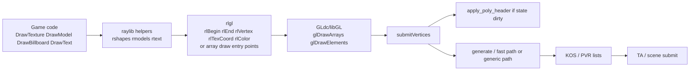
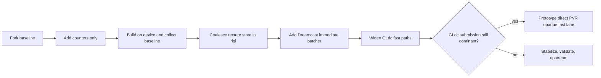

# Rendering Performance Investigation for raylib4Dreamcast and GLdc

## Executive summary

The highest-confidence conclusion is that the best renderer-wide performance win on Dreamcast is **not** a game-specific rewrite, but a backend rewrite that makes raylib’s immediate-style helper traffic behave like a small number of large, state-coherent array draws. The inspected raylib/rlgl and GLdc sources show that GLdc has explicit fast paths for `glDrawArrays` and `glDrawElements`, including specialized handling for quads, triangles, and indexed draws, but those paths still do substantial CPU-side work: state checks, optional poly-header emission, transform loading, per-vertex transform/gather, and attribute copying before KOS/PVR submission. At the same time, raylib helper code commonly emits localized `rlSetTexture(...)`, `rlBegin(RL_QUADS)`, `rlEnd()`, `rlSetTexture(0)` patterns that are convenient on desktop backends but likely expensive on a Dreamcast OpenGL 1.1-style stack. citeturn23view0turn24view0turn24view1turn52view0turn52view1turn64view4turn64view5turn65view5turn65view6

The most important practical recommendation is therefore:

**Keep game code untouched, but add a Dreamcast-only rlgl immediate-mode batcher and state coalescer underneath it.** That batcher should capture simple immediate traffic for quads and triangles using **position + UV + color**, defer local unbinds, merge consecutive compatible draws, and flush only on correctness boundaries such as incompatible state changes, matrix changes, render-target changes, or frame end. That gives raylib “Santa Claus” behavior on Dreamcast while keeping PC/web behavior unchanged behind compile-time guards. citeturn64view5turn65view5turn52view0turn52view1turn24view1

A second high-value change is **GLdc instrumentation first, then GLdc fast-path widening**. The source already provides natural hook points: `glDrawArrays`, `glDrawElements`, `submitVertices()`, `generate()`, `generateElementsFastPath()`, and `apply_poly_header()`. Instrumenting those points will quickly verify whether your frame time is being dominated by tiny draw count, state/header churn, fast-path misses, or raw vertex transform/copy cost. After that, the safest GLdc optimization is to widen fast-path eligibility and specialize common layouts such as **position + UV + color**, **position + UV**, and **position + color**. citeturn23view0turn24view0turn24view1turn52view0turn52view1

A third conclusion is architectural: most meaningful performance work is in the **raylib/rlgl and GLdc/KOS path**, not in the archived wrapper repository itself. The archived `raylib4Dreamcast` repository points to newer console-port work, so repo forks are still useful, but the hot-path changes should be planned against the living raylib/rlgl and GLdc code rather than expecting the wrapper repo alone to be the optimization surface. citeturn9view0turn11view0turn12search2

## Call-flow map

The rendering pipeline that matters for Dreamcast performance is short and very state-sensitive:



That flow matches the inspected source structure: raylib helper code emits rlgl immediate-style operations for many shapes and textured helpers; rlgl exposes both immediate-style and array-draw entry points; GLdc’s `glDrawArrays` and `glDrawElements` feed `submitVertices()`; `submitVertices()` conditionally emits poly headers and then generates PVR-facing vertices; and KOS documents that already-sorted list submission is the fastest PVR path. citeturn64view4turn64view5turn65view5turn23view0turn24view0turn24view1turn62search0turn62search1turn62search3

| Stage | Typical functions / files | What happens | Why it matters on Dreamcast |
|---|---|---|---|
| Game | `DrawTexture*`, `DrawBillboard*`, `DrawModel*`, text/UI helpers | High-level draw intent | Too many tiny calls here can become too many tiny stateful draws downstream |
| raylib helpers | `rshapes.c`, `rmodels.c`, `rtext.c` | Often bind texture, emit quads/triangles, then unbind | Local helper convenience can create global state churn citeturn64view4turn64view5 |
| rlgl | `src/rlgl.h` immediate API and array API | Translates helper calls into backend operations | OpenGL 1.1-style backends do not get the same internal batching assumptions as modern rlgl backends citeturn43view0turn65view5turn65view6 |
| GLdc/libGL | `glDrawArrays`, `glDrawElements`, `submitVertices`, `generate`, `apply_poly_header` | Checks dirty state, emits headers, transforms/gathers vertices, fills PVR submission buffers | CPU cost accumulates even on fast paths citeturn23view0turn24view0turn24view1turn52view0turn52view1 |
| KOS/PVR | PVR list submission path | Sends grouped primitives to TA/PVR lists | Already-sorted submission is fastest; mixed/state-heavy order is worse citeturn62search0turn62search1turn62search3 |

## Bottlenecks and diagnosis

The table below separates **confirmed** bottlenecks from **likely** ones and maps each to an optimization direction.

| Dimension | Confirmed / likely finding | Confidence | Why it matters | Best optimization direction |
|---|---|---:|---|---|
| Draw-call overhead | GLdc array draws still pass through `submitVertices()`, optional header emission, transform loading, vertex generation, and attribute copy. citeturn23view0turn24view0turn24view1turn52view0turn52view1 | High | Even “fast” draws are not cheap; tiny draws multiply CPU overhead | Fewer, larger array draws |
| Batching behavior | rlgl’s documented internal batching assumptions are primarily for modern backends; Dreamcast is using an OpenGL 1.1-style stack, so helper-heavy code is much less likely to batch well automatically. citeturn43view0turn65view5turn65view6 | High | Desktop mental models are misleading here | Add Dreamcast-only rlgl batcher |
| Matrix/state changes | `submitVertices()` checks dirty state and may emit a new poly header; `apply_poly_header()` rebuilds GPU-facing state. citeturn24view0turn24view1 | High | Texture/blend/depth/cull/material churn fragments submission | Coalesce state changes in rlgl |
| Texture/material binds | raylib helper paths visibly bind textures for a helper-local draw and then unbind. citeturn64view5 | High | Helper-local binds become global churn in GLdc | Defer unbinds, merge same-texture runs |
| Vertex array usage | GLdc’s best-exposed fast lane is `glDrawArrays` / `glDrawElements` with fast-path generation. citeturn23view0turn52view0turn52view1 | High | Array submission is the backend’s intended optimized path | Feed it more often |
| Indexed vs de-indexed geometry | GLdc’s indexed fast path still loops indices and transforms/copies per referenced vertex. citeturn52view1 | High | Indexing is not a free hardware post-transform cache on this stack | Use indexing selectively; allow de-indexed hot quad paths |
| Immediate-mode paths | raylib helper and rlgl immediate calls are convenient but likely costly on Dreamcast. citeturn64view4turn64view5turn65view5turn65view6 | Medium-high | Many tiny immediate primitives are the worst fit for GLdc/KOS/PVR | Capture and defer them in rlgl |
| GLdc internal fast paths | `generate()` dispatches to dedicated fast paths for arrays/quads/triangles/indexed draws. citeturn52view0turn52view1 | High | There is something worth steering into | Widen eligibility and specialize common layouts |
| PVR submission strategy | KOS states that direct rendering is fastest when submission is already grouped by list/primitive type. citeturn62search0turn62search1turn62search3 | High | Alternating opaque/translucent/stateful order fights the hardware | Preserve list coherence; optional direct path later |
| Avoidable conversions / copies | Even fast paths gather/copy attributes; community Dreamcast-port evidence suggests texture-path copy/alignment work can matter too. citeturn52view1turn25search0 | Medium | CPU bandwidth and conversion work can dominate hot scenes | Specialize attributes first, texture-path cleanup second |

Two bottlenecks deserve special emphasis. The first is **state churn**. In the inspected GLdc path, state dirtiness does not just mean “another bind.” It can trigger a new poly-header build and more fragmented submission buffers. That makes frequent texture/material/blend/depth changes unusually expensive compared with a modern desktop driver. citeturn24view0turn24view1

The second is **helper-local immediate traffic**. In official raylib helper code, textured shapes and related helpers visibly use small `rlSetTexture(...)`, `rlBegin(RL_QUADS)`, vertex emission, `rlEnd()`, `rlSetTexture(0)` sequences. That style is fine for portability and readability, but it is exactly the pattern that a Dreamcast port should intercept and coalesce underneath the game code. citeturn64view4turn64view5turn65view5

## Fast-path use, state churn, formats, and Dreamcast-specific assumptions

**Does raylib/rlgl currently use GLdc fast paths well?** Only partially. If a path reaches GLdc as `glDrawArrays` or `glDrawElements` in a compatible layout, then yes: GLdc has explicit fast-path logic for those modes. But many helper-heavy raylib paths are expressed in immediate-style rlgl calls rather than long-lived array draws, so the backend’s best path is likely underused in exactly the 2D/UI/sprite/procedural traffic that tends to dominate Dreamcast frame time. citeturn23view0turn52view0turn52view1turn64view5turn65view5turn65view6

**Where does state churn happen?** The churn happens in two layers at once. At the raylib layer, helper code performs helper-local state changes such as setting a shapes texture, emitting a small primitive run, and restoring texture state. At the GLdc layer, any dirty GPU state can force `submitVertices()` to emit a new poly header through `apply_poly_header()`. That compounds the cost: the same bind/unbind pattern both increases API traffic and fragments PVR-facing submission. citeturn64view5turn24view0turn24view1

**Are vertex formats and draw patterns causing unnecessary conversion?** Yes, in two ways. First, GLdc fast paths still gather and copy attribute streams into submission memory, so every enabled attribute that is unnecessary for a hot path is extra CPU work. Second, indexed draws still incur per-index gather and transform in GLdc’s indexed fast path, so “indexed is better” is not universally true here. The best common-format target for Dreamcast helper paths is therefore a narrow interleaved format such as **position + UV + color**, with normals or extra UV sets avoided unless they materially affect output. citeturn52view0turn52view1

**Which Dreamcast-specific raylib assumptions hurt performance?** The recurring assumptions are:

| Assumption | Why it is dangerous on Dreamcast | Better rule |
|---|---|---|
| “Immediate-style helper drawing is fine if it is portable.” | The OpenGL 1.1-style backend does not transparently absorb tiny draw traffic the way modern backends can. citeturn43view0turn65view6 | Capture immediate traffic and batch it underneath |
| “`rlSetTexture(0)` is a harmless cleanup.” | On Dreamcast it can become unnecessary state dirtiness and header churn. citeturn64view5turn24view1 | Defer unbinds and cancel them if a compatible textured draw follows |
| “Matrix push/pop per helper is cheap.” | Matrix changes can become batch flush boundaries unless handled explicitly | Track matrix-generation changes; consider pretransform only if profiling proves it is worth it |
| “Indexed geometry is always the optimal representation.” | GLdc still parses indices and transforms/gathers referenced vertices in software. citeturn52view1 | Use indexing selectively; allow de-indexed hot paths |
| “Generic state order is fine as long as GL semantics are correct.” | KOS/PVR prefers already-grouped list submission. citeturn62search0turn62search1 | Preserve opaque/translucent and same-state runs where possible |

## Proposed patches and minimal diff sketches

The patch set below is ordered from **highest value with lowest risk** to **high-value but invasive**. File paths use canonical upstream raylib naming where known; for GLdc, if your fork’s layout differs, use the listed function names as search anchors. The inspected source definitely exposed the function anchors `glDrawArrays`, `glDrawElements`, `submitVertices`, `generate`, `generateElementsFastPath`, and `apply_poly_header`. citeturn23view0turn24view0turn24view1turn52view0turn52view1turn65view5

**Patch A: Dreamcast-only rlgl immediate-mode batcher for quads and triangles**

**Target:** `raylib/src/rlgl.h` inside the OpenGL 1.1 backend path.

**Intent:** Capture `rlBegin` / `rlVertex*` / `rlTexCoord*` / `rlColor*` traffic for `RL_QUADS` and `RL_TRIANGLES`, convert it into a batched interleaved array, and flush to GLdc with `glDrawArrays()` only when correctness requires it.

**Minimal behavior:**
- Capture only **position + UV + color** for the Dreamcast fast lane.
- Keep current fallback behavior for lines, points, unsupported attributes, or unsupported state.
- Track a **matrix generation counter**. Minimal safe version: flush whenever the current matrix changes.
- Track texture ID, blend/depth/cull/scissor state, draw mode, and render-target state.
- Defer flush at `rlEnd()`; keep the batch open across consecutive compatible draws.
- Flush on:
  - incompatible texture change,
  - incompatible blend/depth/cull/scissor change,
  - matrix change,
  - render-target change,
  - mode change,
  - explicit batch drain or frame end,
  - batch capacity full.

**Sketch:**

```diff
--- a/src/rlgl.h
+++ b/src/rlgl.h
@@
+#if defined(PLATFORM_DREAMCAST)
+#define RLGL_DC_IMBATCH 1
+typedef struct rlDcImVertex {
+    float x, y, z;
+    float u, v;
+    unsigned char r, g, b, a;
+} rlDcImVertex;
+
+typedef struct rlDcImBatch {
+    rlDcImVertex *v;
+    int count, capacity;
+    int mode;                  // RL_QUADS or RL_TRIANGLES
+    unsigned int textureId;
+    unsigned int matrixGen;
+    bool blend, depthTest, depthMask, cull;
+    bool active;
+} rlDcImBatch;
+
+static rlDcImBatch RLDC = {0};
+static unsigned int rlDcMatrixGen = 1;
+static void rlDcFlushImmediateBatch(void);
+static bool rlDcCanAppend(int mode, unsigned int texId);
+#endif
@@ void rlBegin(int mode)
+#if defined(RLGL_DC_IMBATCH)
+    if ((mode == RL_QUADS) || (mode == RL_TRIANGLES)) {
+        RLGL.State.dcCapture = true;
+        RLGL.State.dcMode = mode;
+        return;
+    }
+#endif
@@ void rlVertex3f(float x, float y, float z)
+#if defined(RLGL_DC_IMBATCH)
+    if (RLGL.State.dcCapture) {
+        rlDcAppendVertex(x, y, z, RLGL.State.texcoordx, RLGL.State.texcoordy,
+                         RLGL.State.colorr, RLGL.State.colorg,
+                         RLGL.State.colorb, RLGL.State.colora);
+        return;
+    }
+#endif
@@ void rlEnd(void)
+#if defined(RLGL_DC_IMBATCH)
+    if (RLGL.State.dcCapture) {
+        RLGL.State.dcCapture = false;
+        return; // defer real submit until flush boundary
+    }
+#endif
```

A slightly safer phase-one version should **flush on any matrix mutation** rather than try to merge across different transforms. That keeps correctness simple. A phase-two refinement can optionally pretransform captured vertices into world/view space so push/pop-heavy helper code no longer forces flushes, but that should be gated behind profiling. The immediate rationale for this patch is directly supported by the combination of helper-local immediate drawing in raylib and GLdc’s stronger preference for array submission. citeturn64view4turn64view5turn23view0turn52view0turn52view1

**Patch B: GLdc instrumentation counters**

**Target:** the GLdc compilation units containing `glDrawArrays`, `glDrawElements`, `submitVertices`, `generate`, `generateElementsFastPath`, and `apply_poly_header()`. If your fork splits texture binding or dirty-state setters elsewhere, instrument those setters too.

**Intent:** Make hardware-guided decisions instead of arguing from code style alone.

**Suggested counter block:**

```c
typedef struct GLdcStats {
    uint64_t frame_no;
    uint64_t draw_arrays_calls;
    uint64_t draw_elements_calls;
    uint64_t fast_path_hits;
    uint64_t fast_path_misses;
    uint64_t headers_emitted;
    uint64_t state_dirty_events;
    uint64_t vertices_transformed;
    uint64_t bytes_copied;
    uint64_t texture_binds;
} GLdcStats;

extern GLdcStats g_gldc_stats;
void glKosResetStats(void);
const GLdcStats *glKosGetStats(void);
void glKosPrintStats(void);
```

**Hook points:**
- `glDrawArrays`: increment `draw_arrays_calls`.
- `glDrawElements`: increment `draw_elements_calls`.
- `generate()`: increment `fast_path_hits` / `fast_path_misses`.
- `generateElementsFastPath()` and array fast generators: increment `vertices_transformed`; add source-attribute `bytes_copied` accounting.
- `apply_poly_header()`: increment `headers_emitted`.
- texture bind entry point: increment `texture_binds`.
- dirty-state transition site: increment `state_dirty_events` when state flips from clean to dirty.

**Sketch:**

```diff
--- a/GLdc/.../draw_or_submit_file.c
+++ b/GLdc/.../draw_or_submit_file.c
@@
+GLdcStats g_gldc_stats = {0};
@@ void glDrawArrays(GLenum mode, GLint first, GLsizei count)
+    g_gldc_stats.draw_arrays_calls++;
@@ void glDrawElements(GLenum mode, GLsizei count, GLenum type, const GLvoid *indices)
+    g_gldc_stats.draw_elements_calls++;
@@ static void apply_poly_header(...)
+    g_gldc_stats.headers_emitted++;
@@ static void generate(...)
+    if (ATTRIB_LIST.fast_path) g_gldc_stats.fast_path_hits++;
+    else g_gldc_stats.fast_path_misses++;
```

This patch is low risk and should come first. The inspected GLdc source gives clear enough hook sites to do it cleanly. citeturn23view0turn24view0turn24view1turn52view0turn52view1

**Patch C: Widen GLdc fast-path eligibility for common layouts**

**Target:** the GLdc source around `generate()` and `generateElementsFastPath()`.

**Intent:** Treat common raylib draw layouts as first-class cases rather than falling back to generic attribute handling.

**Recommended first layouts:**
- `P + UV + Color`
- `P + UV`
- `P + Color`

**Approach:**
- Add an explicit attribute mask for the common enabled-array subsets.
- Dispatch to specialized generators that assume exactly the common layout and avoid generic per-attribute branching.
- Do arrays first; add indexed variants only after array variants are stable.

**Sketch:**

```diff
--- a/GLdc/.../generate_file.c
+++ b/GLdc/.../generate_file.c
@@
+enum {
+    ATTR_MASK_P    = 1 << 0,
+    ATTR_MASK_UV   = 1 << 1,
+    ATTR_MASK_CLR  = 1 << 2,
+    ATTR_MASK_NRM  = 1 << 3,
+    ATTR_MASK_ST2  = 1 << 4
+};
@@ static void generate(...)
-    if (ATTRIB_LIST.fast_path) {
-        ...
-    }
+    unsigned mask = currentAttribMask();
+    if (mask == (ATTR_MASK_P|ATTR_MASK_UV|ATTR_MASK_CLR)) {
+        return generateArraysFastPathPUVC(...);
+    } else if (mask == (ATTR_MASK_P|ATTR_MASK_UV)) {
+        return generateArraysFastPathPUV(...);
+    } else if (mask == (ATTR_MASK_P|ATTR_MASK_CLR)) {
+        return generateArraysFastPathPC(...);
+    } else if (ATTRIB_LIST.fast_path) {
+        ...
+    }
```

This recommendation follows directly from the existing GLdc fast-path structure and the fact that even current fast paths still spend CPU time on attribute gather/copy. Narrowing the common case reduces branchiness and memory traffic. citeturn52view0turn52view1

**Patch D: Coalesce state changes in rlgl**

**Target:** `raylib/src/rlgl.h`, primarily `rlSetTexture()`, batch flush helpers, and the Dreamcast batcher state block from Patch A.

**Intent:** Avoid needless hardware-visible state churn caused by helper-local cleanup patterns.

**Minimal rules:**
- If `rlSetTexture(0)` follows a small textured immediate draw, do **not** immediately flush or unbind. Mark a deferred-unbind flag instead.
- If the next qualified draw uses the same texture, cancel the deferred unbind.
- If the next qualified draw uses a different texture or genuinely requires the untextured/default path, flush then apply.
- If `rlSetTexture(newId)` equals the current batch texture and there is no incompatible state change, treat it as a no-op.
- Keep `rlEnd()` from forcing a flush for compatible same-state runs.

**Sketch:**

```diff
--- a/src/rlgl.h
+++ b/src/rlgl.h
@@
+#if defined(RLGL_DC_IMBATCH)
+static unsigned int rlDcLogicalTexture = 0;
+static bool rlDcPendingUnbind = false;
+#endif
@@ void rlSetTexture(unsigned int id)
+#if defined(RLGL_DC_IMBATCH)
+    if (id == 0) {
+        rlDcPendingUnbind = true;
+        rlDcLogicalTexture = 0;
+        return;
+    }
+    if (rlDcPendingUnbind && (id == RLDC.textureId)) {
+        rlDcPendingUnbind = false;
+        rlDcLogicalTexture = id;
+        return; // keep existing batch alive
+    }
+    if (RLDC.active && (id != RLDC.textureId)) rlDcFlushImmediateBatch();
+    rlDcPendingUnbind = false;
+    rlDcLogicalTexture = id;
+#endif
```

This is the cheapest optimization that preserves user-facing semantics while removing a common source of redundant churn visible in official helper code. citeturn64view5turn24view1

**Patch E: Optional direct PVR submission path**

**Target:** a Dreamcast-only experimental fork, not the first upstream target.

**Intent:** Explore a direct opaque fast lane for already-sorted textured triangles/quads that bypasses more GLdc overhead and writes PVR-ready submission streams more directly.

**Use only if:**
- counters show GLdc submission remains the dominant cost after Patches A–D,
- your scene is dominated by opaque textured sprites/meshes,
- you can tolerate a backend-only fork.

**Architecture guidance:**
- Limit the direct path to **opaque textured quads/triangles** first.
- Keep GLdc for everything else: translucent primitives, odd states, rare formats, readback-sensitive paths.
- Reuse KOS list ordering rules: opaque first, translucent later, already grouped by PVR list type.

This path could be very fast, but it raises the most risk: duplicate state tracking, GL semantic divergence, debug complexity, and portability cost. KOS’s own documentation is the reason to consider it at all: direct submission is fastest when the data is already sorted appropriately. citeturn62search0turn62search1turn62search3

## Measurement, benchmarks, instrumentation, and rollout

The rollout should be metric-driven from day one. Do **not** start with a giant refactor. Start with counters, then introduce the smallest behavior-preserving batching changes, then widen fast paths, then revisit architecture.



A practical step-by-step action plan is:

| Step | Action | Output |
|---|---|---|
| Fork | Fork the active raylib Dreamcast port you are using, upstream raylib if needed, and your GLdc fork. Treat the archived wrapper repo as secondary. citeturn9view0turn11view0turn12search2 | Isolated branches for renderer work |
| Baseline | Build the current game unchanged and confirm visual correctness on hardware | Known-good baseline |
| Counters | Add GLdc counters and a tiny rlgl-side counter block for `rlBegin`, `rlEnd`, `rlSetTexture`, batch flushes | Hard numbers by scene |
| Bench scenes | Create microbenchmarks that isolate each suspected problem | Controlled repeatable tests |
| Patch D first | Defer unbinds and same-texture coalescing | Low-risk early win |
| Patch A next | Add Dreamcast-only immediate batcher | Large likely win with preserved API |
| Patch C next | Widen GLdc fast paths for common layouts | Lower CPU per submitted vertex |
| Patch E last | Only if counters still point at submission overhead | Optional invasive branch |

**Recommended microbenchmarks/scenes**

| Scene | What it isolates | Suggested target metrics |
|---|---|---|
| Same-texture quad storm | Pure draw-call and helper overhead | Draw calls, headers emitted, fast-path hit rate, frame ms |
| Alternating-texture quad storm | Texture/material churn | Texture binds, headers emitted, frame ms |
| Matrix-churn billboard storm | Push/pop and transform-induced flushes | Batch flushes, frame ms, correctness |
| Indexed vs de-indexed mesh scene | Index gather vs de-indexed arrays | Vertices transformed, bytes copied, frame ms |
| Opaque then translucent sprites | PVR list coherence | Headers emitted, frame ms, visual correctness |
| Text/UI stress scene | Realistic helper-heavy workload | rlgl batch flushes, draw counts, frame ms |

**Metrics to collect per frame**
- frame time in microseconds or milliseconds,
- `glDrawArrays` count,
- `glDrawElements` count,
- fast-path hits and misses,
- headers emitted,
- state-dirty events,
- vertices transformed,
- source-attribute bytes copied,
- texture binds,
- rlgl immediate batch flushes,
- average vertices per flush.

**Reasonable acceptance criteria**
- same-texture quad scene: **very large** reduction in draw calls and headers, with a visible frame-time drop;
- alternating-texture scene: smaller but still meaningful reduction from deferred unbinds and same-texture run merging;
- no visual regressions in blending, depth, or UI layering;
- no PC/web behavior change because all new behavior is under Dreamcast-only compile guards.

**Suggested test-harness snippets**

A simple GLdc frame printer:

```c
static void DumpGLdcStatsEveryNFrames(int n) {
    static int frameCounter = 0;
    if (++frameCounter < n) return;
    frameCounter = 0;

    const GLdcStats *s = glKosGetStats();
    printf("GLdc: arr=%llu elem=%llu fast=%llu miss=%llu hdr=%llu dirty=%llu vtx=%llu bytes=%llu tex=%llu\n",
        (unsigned long long)s->draw_arrays_calls,
        (unsigned long long)s->draw_elements_calls,
        (unsigned long long)s->fast_path_hits,
        (unsigned long long)s->fast_path_misses,
        (unsigned long long)s->headers_emitted,
        (unsigned long long)s->state_dirty_events,
        (unsigned long long)s->vertices_transformed,
        (unsigned long long)s->bytes_copied,
        (unsigned long long)s->texture_binds);

    glKosResetStats();
}
```

A tiny rlgl-side counter block for the Dreamcast batcher:

```c
typedef struct rlDcStats {
    uint64_t begin_calls;
    uint64_t end_calls;
    uint64_t set_texture_calls;
    uint64_t batch_flushes;
    uint64_t flush_tex_changes;
    uint64_t flush_state_changes;
    uint64_t flush_matrix_changes;
    uint64_t appended_vertices;
} rlDcStats;

static rlDcStats g_rl_dc_stats;
```

Recommended placement:
- `raylib/src/rlgl.h`: `rlBegin`, `rlEnd`, `rlSetTexture`, matrix mutation helpers, Dreamcast batch flush helper.
- GLdc: `glDrawArrays`, `glDrawElements`, `generate`, `generateElementsFastPath`, `apply_poly_header`, and the state-dirty setter path if it is centralized. Those exact function anchors are known from the inspected source; the exact file path may vary by fork. citeturn23view0turn24view0turn24view1turn52view0turn52view1turn65view5

## Risk, effort, implementation order, and open questions

The simplest stable order is: **instrument -> coalesce state -> batch immediate traffic -> widen GLdc fast paths -> consider direct PVR path**.

| Change | Expected win | Effort | Risk | Why this rank |
|---|---:|---:|---:|---|
| GLdc counters and rlgl counters | High diagnostic value | Low | Low | Required to validate every later claim |
| rlgl deferred unbinds / same-texture coalescing | Medium | Low | Low | Easy win, minimal semantic risk |
| Dreamcast-only rlgl immediate batcher | High | Medium | Medium | Best likely broad win without touching game code |
| GLdc fast-path widening for common layouts | Medium-high | Medium | Medium | Lowers CPU cost once batching improves submission shape |
| Matrix pretransform refinement | Medium, scene-dependent | Medium | Medium-high | Useful only if matrix churn is dominant after phase one |
| Direct PVR opaque fast lane | Potentially very high | High | High | Strong upside but most invasive and least portable |

The biggest open questions are all matters for on-device measurement, not for source inspection alone. The inspected sources are enough to justify the optimization direction, but they do not tell you the exact split between: helper-level immediate overhead, header/state churn, indexed gather cost, and raw vertex transform cost in your specific game. That is why the first deliverable should be counters, not a renderer rewrite. citeturn23view0turn24view0turn24view1turn52view0turn52view1

Two smaller limitations are worth stating clearly. First, the `raylib4Dreamcast` wrapper repo is archived, so exact file layout and active branch names may differ from the code you are actually shipping; use the function anchors above if your fork diverges. Second, the direct immediate-mode implementation details of every rlgl/OpenGL 1.1 edge case were not all exposed in the inspected snippets, so the Dreamcast batcher proposal should start conservative: support only quads/triangles with simple attributes, flush on uncertain state, and expand once the counter data justifies more aggressive behavior. citeturn9view0turn11view0turn43view0turn65view5turn65view6

The most actionable final recommendation is therefore straightforward:

**Fork your current raylib port and GLdc, add counters first, then make Dreamcast rlgl lie better.** If you can make five hundred tiny helper-local textured quad draws behave like a few dozen sane array submissions with fewer binds and fewer headers, you are attacking the part of the pipeline that the source most strongly indicates is costing you the most time.